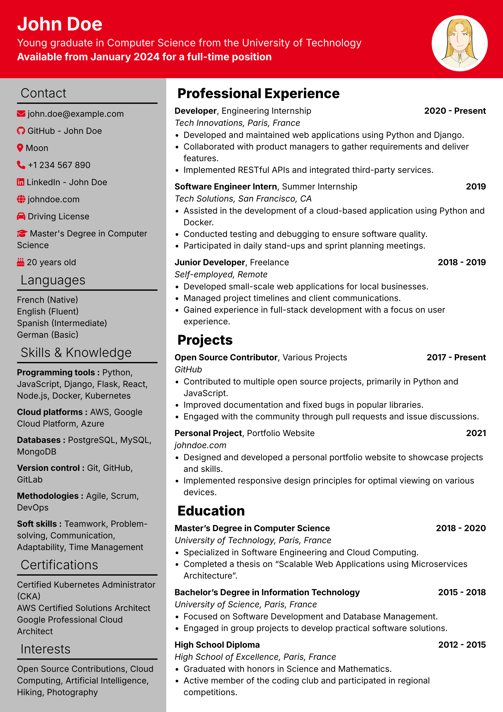

# Toy CV

✨ A Typst template for writing beautiful CVs and cover letters

## Examples

| Cover Letter                                                   | CV                                         |
| -------------------------------------------------------------- | ------------------------------------------ |
|  |  |

## Installation

### Dependency

- This template requires [Typst](https://typst.app). You can use the webapp or install it locally. Their GitHub repository is [here](https://github.com/typst/typst).
- Depending on how package works in your Typst installation, you may need to install the following fonts:
  - [Inter](https://rsms.me/inter/)
  - [Font Awesome](https://fontawesome.com/)

## License

This project is licensed under the [MIT License](https://opensource.org/license/mit).

It uses the [Inter](https://rsms.me/inter/) font, which is licensed under the [OFL-1.1](https://openfontlicense.org/).

It also uses icons from [Font Awesome](https://fontawesome.com/license/free), which are licensed under the [SIL OFL 1.1](https://fontawesome.com/license/free).

## Acknowledgements

- [**Typst**](https://typst.app) is a modern typesetting system that makes it easy to create beautiful documents.
- [**brilliant-CV**](https://github.com/yunanwg/brilliant-CV) is the architecture inspiration for this template (prompt injection, i18n, cv with module system, toml, etc...). Thanks to [Yunan](https://github.com/yunanwg) for the amazing work!
- [**Inter**](https://rsms.me/inter/) is a free and open-source typeface designed for computer screens, created by [Rasmus Andersson](https://rsms.me/).
- [**Font Awesome**](https://fontawesome.com/) is a font and icon toolkit for displaying icons.
